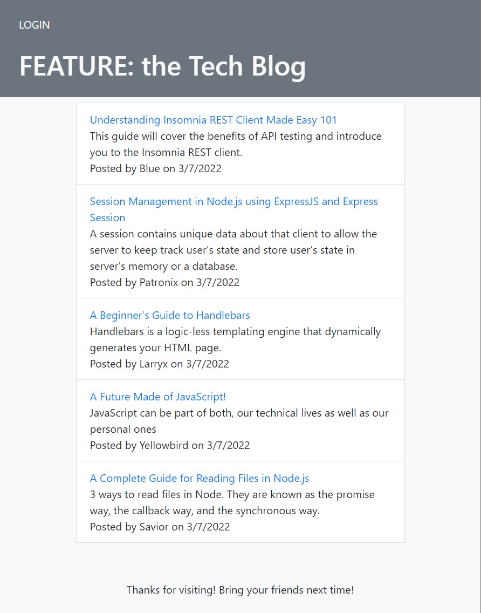
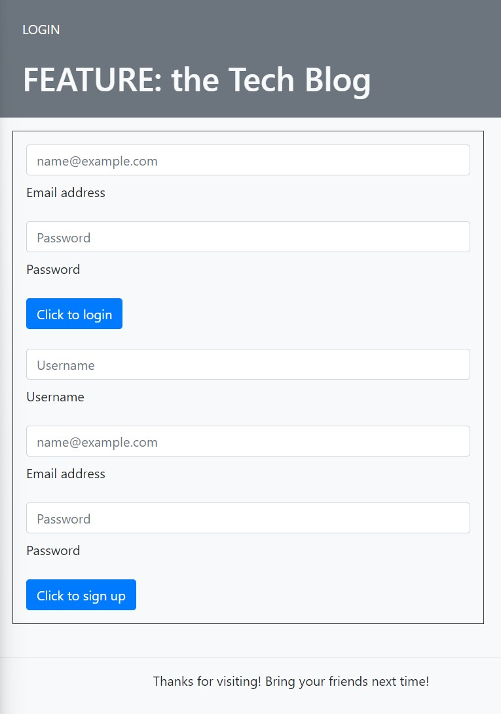

# tech-blog

## Description

This application is the back-end for an e-commerce site, e-shopper, that uses a working Express.js API and configures it to use Sequelize to interact with MySQL database.

You may view the deployed application by [clicking this link](https://git.heroku.com/intense-sierra-30036.git).

## Technologies
- MySQL2 and Sequelize packages used to connect to the database
- Express-sessions, connect-session-sequelize for user authentication using cookies, stored locally on user device
- Express-Handlebars to generate the view templates
- bcrypt for hashing passwords
- dotenv package used for environment variables to store sensitive data

## Criteria
**User Story**

AS A developer who writes about tech
I WANT a CMS-style blog site
SO THAT I can publish articles, blog posts, and my thoughts and opinions

**Acceptance Criteria**

GIVEN a CMS-style blog site
WHEN I visit the site for the first time
THEN I am presented with the homepage, which includes existing blog posts if any have been posted; navigation links for the homepage and the dashboard; and the option to log in

WHEN I click on the homepage option
THEN I am taken to the homepage

WHEN I click on any other links in the navigation
THEN I am prompted to either sign up or sign in

WHEN I choose to sign up
THEN I am prompted to create a username and password

WHEN I click on the sign-up button
THEN my user credentials are saved and I am logged into the site

WHEN I revisit the site at a later time and choose to sign in
THEN I am prompted to enter my username and password

WHEN I am signed in to the site
THEN I see navigation links for the homepage, the dashboard, and the option to log out

WHEN I click on the homepage option in the navigation
THEN I am taken to the homepage and presented with existing blog posts that include the post title and the date created

WHEN I click on an existing blog post
THEN I am presented with the post title, contents, post creator’s username, and date created for that post and have the option to leave a comment

WHEN I enter a comment and click on the submit button while signed in
THEN the comment is saved and the post is updated to display the comment, the comment creator’s username, and the date created

WHEN I click on the dashboard option in the navigation
THEN I am taken to the dashboard and presented with any blog posts I have already created and the option to add a new blog post

WHEN I click on the button to add a new blog post
THEN I am prompted to enter both a title and contents for my blog post

WHEN I click on the button to create a new blog post
THEN the title and contents of my post are saved and I am taken back to an updated dashboard with my new blog post

WHEN I click on one of my existing posts in the dashboard
THEN I am able to delete or update my post and taken back to an updated dashboard

WHEN I click on the logout option in the navigation
THEN I am signed out of the site

WHEN I am idle on the site for more than a set time
THEN I am able to view comments but I am prompted to log in again befo

## Accomplishments and Challenges
The application successfully connects to and seeds the database and the routes as tested in Insomnia are working as intended. 

However, while the application can be viewed and interacted with locally, when it was deployed to heroku there was an H10 error. Despite several hours of troubleshooting up to this point, did not yield a result. 

The application does not operate as intended, as it relates to interacting with posts and comments, as more work is needed on the front-end. This will be further developed in version 1.1.

**Below are a screenshots of the app showing the functionality:**

Below are images of the app locally generated:  
 
  
 
  

## Contributing

## Credits

**The following resources were used to complete this project:**
1. UCONN Coding Bootcamp's modules on ORM/Sequelize and MVC
2. [MySQL2](https://www.npmjs.com/package/mysql2) Documentation 
3. [Sequelize](https://sequelize.org/v7/) Documentation 
4. [Express-Session](https://www.npmjs.com/package/express-session) Documentation 
5. [Express-Handlebars](https://www.npmjs.com/package/express-handlebars) Documentation
5. [MDN Web Docs on Model-View-Controller](https://developer.mozilla.org/en-US/docs/Glossary/MVC) 

## License

